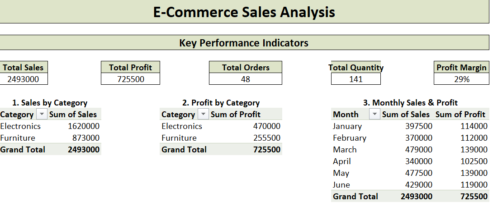
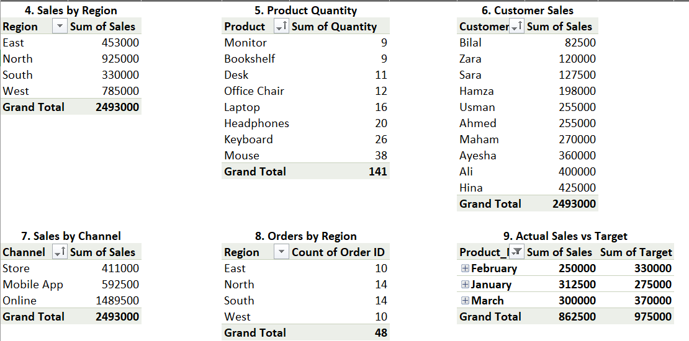
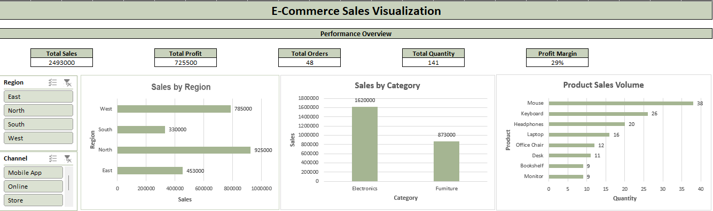
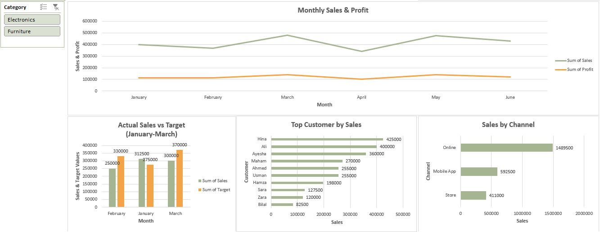
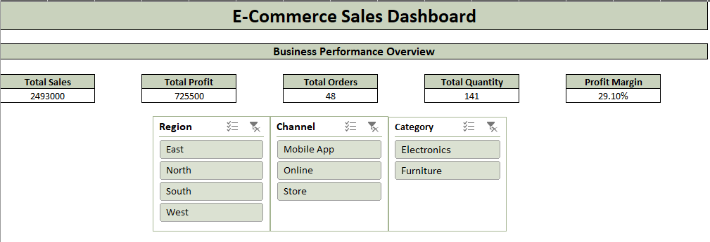
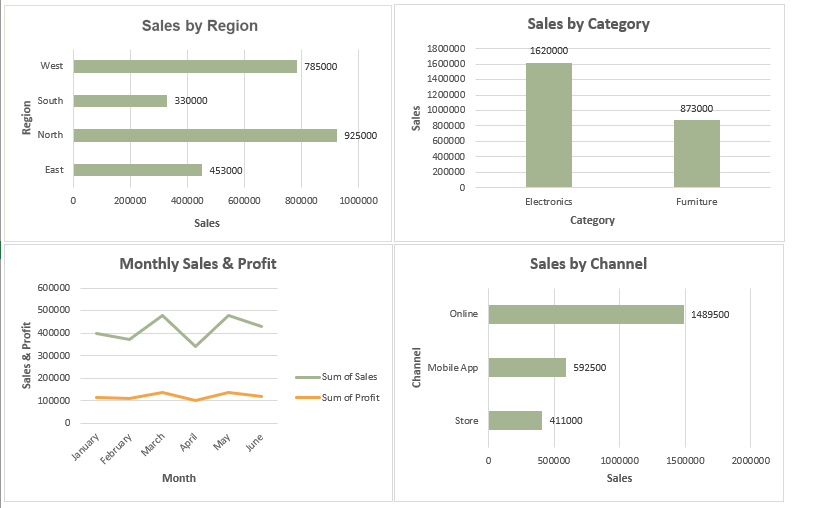

#  E-Commerce Sales Analysis — Excel Project

##  Project Overview

This project is an **E-Commerce Sales Analysis Dashboard built in Microsoft Excel**. The purpose of this project is to transform raw e-commerce order data into meaningful business insights using **data cleaning, Excel formulas, Power Query, PivotTables, charts, KPIs, target comparison, and an interactive dashboard**.

The project analyzes sales performance across different **products, categories, regions, customers, sales channels, and months**, while also comparing actual sales with predefined monthly targets.

This project demonstrates practical **Excel Data Analytics** skills and follows a complete data analysis workflow:

**Raw Data → Data Cleaning → Data Preparation → Analysis → Visualization → Dashboard → Business Insights**


##  Project Objectives

The main objectives of this project are to:

* Clean and prepare raw e-commerce sales data
* Calculate important business metrics such as Sales, Cost, Profit, and Profit Margin by using power query editor
* Analyze sales performance by category, region, product, customer, channel, and month
* Identify products with higher sales quantities
* Analyze customer purchasing performance
* Compare actual sales against monthly sales targets
* Create PivotTables for business analysis
* Build charts and visualizations for easier interpretation
* Develop an interactive Excel dashboard
* Present the final analysis in a professional and easy-to-understand format


##  Dataset Description

The project contains e-commerce order information including:

| Column      | Description                        |
| ----------- | ---------------------------------- |
| Order ID    | Unique identifier for each order   |
| Customer ID | Unique customer identifier         |
| Order Date  | Date on which the order was placed |
| Product     | Product purchased                  |
| Category    | Product category                   |
| Region      | Sales region                       |
| Channel     | Sales channel                      |
| Quantity    | Number of units purchased          |
| Sales       | Revenue generated from the order   |
| Cost        | Cost associated with the order     |
| Customer    | Customer name                      |

Additional customer information includes:

* Customer Name
* Email
* City

The project also contains monthly sales targets for different products for **January, February, and March**.


##  Project Structure

The Excel workbook is organized into the following sheets:

### 1. `Raw_Orders`

Contains the original raw e-commerce order data.

This sheet represents the starting point of the analysis before data cleaning and preparation.


### 2. `Clean_Orders`

Contains the cleaned and prepared dataset used for analysis.

Additional calculated fields were created, including:

* Profit
* Profit Margin
* Order Value
* Month
* Customer Name
* City
* Product_Month

#### Calculated Metrics

**Profit**

```excel
=Sales-Cost
```

**Profit Margin**

```excel
=(Sales-Cost)/Sales
```

The cleaned dataset provides a structured foundation for PivotTable analysis and visualization.


### 3. `Customers`

Contains customer-related information such as:

* Customer ID
* Customer Name
* Email
* City

This information was used to enrich the order data and perform customer-level analysis.

### 4. `Monthly_Targets`

Contains predefined sales targets for products for:

* January
* February
* March

Products include:

* Laptop
* Mouse
* Keyboard
* Monitor
* Office Chair

### 5. `Monthly_Targets_Clean`

The target data was transformed into a cleaner structure containing:

* Product
* Month
* Target
* Product_Month

The `Product_Month` field was used to connect product and month information for actual-vs-target analysis.


### 6. `Analysis`

Contains the main PivotTable-based analysis and Key Performance Indicators (KPIs).

The analysis covers:

1. Sales by Category
2. Profit by Category
3. Monthly Sales and Profit
4. Sales by Region
5. Product Quantity
6. Customer Sales
7. Sales by Channel
8. Orders by Region
9. Actual Sales vs Target 

### 7. `Visualization`

Contains charts created from the analyzed data to communicate important sales trends and comparisons visually.

The visualizations make it easier to identify:

* Sales patterns
* Category performance
* Regional performance
* Product demand
* Channel performance
* Monthly trends
* Actual sales vs target


### 8. `Dashboard`

Contains the final interactive **E-Commerce Sales Dashboard**.

The dashboard brings together important KPIs, charts, and interactive filtering elements into one consolidated view.


#  Key Performance Indicators

The analysis produced the following overall KPIs:

| KPI                    |        Result |
| ---------------------- | ------------: |
|  Total Sales           | **2,493,000** |
|  Total Profit          |   **725,500** |
|  Total Orders          |        **48** |
|  Total Quantity Sold   |       **141** |
|  Overall Profit Margin |    **~29.1%** |

These KPIs provide a quick overview of the overall business performance represented in the dataset.


#  Analysis Performed

## 1. Sales by Category

Sales were analyzed across product categories.

| Category    |         Sales |
| ----------- | ------------: |
| Electronics |     1,620,000 |
| Furniture   |       873,000 |
| **Total**   | **2,493,000** |

The analysis shows the contribution of each category to total sales.

## 2. Profit by Category

Profit performance was also analyzed by category.

| Category    |      Profit |
| ----------- | ----------: |
| Electronics |     470,000 |
| Furniture   |     255,500 |
| **Total**   | **725,500** |


## 3. Monthly Sales & Profit

Monthly performance was analyzed to understand sales and profit trends throughout the period.

| Month     |         Sales |      Profit |
| --------- | ------------: | ----------: |
| January   |       397,500 |     114,000 |
| February  |       370,000 |     112,000 |
| March     |       479,000 |     139,000 |
| April     |       340,000 |     102,500 |
| May       |       477,500 |     139,000 |
| June      |       429,000 |     119,000 |
| **Total** | **2,493,000** | **725,500** |

This analysis helps identify monthly changes in revenue and profitability.


## 4. Sales by Region

Sales were analyzed across four regions:

| Region    |         Sales |
| --------- | ------------: |
| North     |       925,000 |
| West      |       785,000 |
| East      |       453,000 |
| South     |       330,000 |
| **Total** | **2,493,000** |

## 5. Product Quantity Analysis

The quantity sold for each product was analyzed to understand product demand.

| Product      | Quantity Sold |
| ------------ | ------------: |
| Mouse        |            38 |
| Keyboard     |            26 |
| Headphones   |            20 |
| Laptop       |            16 |
| Office Chair |            12 |
| Desk         |            11 |
| Monitor      |             9 |
| Bookshelf    |             9 |
| **Total**    |       **141** |


## 6. Customer Sales Analysis

Customer-level sales were analyzed to understand individual customer contribution to total sales.

The analysis includes customers such as:

* Ali
* Hina
* Ayesha
* Maham
* Usman
* Ahmed
* Hamza
* Sara
* Zara
* Bilal

This helps identify high-value customers and understand customer purchasing patterns.


## 7. Sales by Channel

Sales were analyzed across three different channels.

| Channel    |         Sales |
| ---------- | ------------: |
| Online     |     1,489,500 |
| Mobile App |       592,500 |
| Store      |       411,000 |
| **Total**  | **2,493,000** |

This analysis helps compare the contribution of different sales channels.


## 8. Orders by Region

The number of orders was analyzed across regions.

| Region    | Orders |
| --------- | -----: |
| North     |     14 |
| South     |     14 |
| East      |     10 |
| West      |     10 |
| **Total** | **48** |


## 9. Actual Sales vs Target

The project also compares actual sales against predefined monthly targets for selected products.

The target data covers:

* January
* February
* March

This analysis helps identify the difference between **actual sales performance and planned sales targets**.

A dedicated PivotTable and visualization were created for this comparison.


#  Excel Features & Techniques Used

This project demonstrates several practical Excel data analytics techniques.

### Data Cleaning

* Cleaning Customer IDs
* Removing unnecessary spaces
* Structuring raw order data
* Checking data consistency
* Preparing data for analysis

### Excel Formulas using Power Query

* Profit calculation
* Profit Margin calculation
* Order Value calculation
* Month extraction
* IFERROR
* GETPIVOTDATA

### Data Analysis

* PivotTables
* Aggregations
* Grouping
* Category analysis
* Regional analysis
* Customer analysis
* Product analysis
* Channel analysis
* Monthly analysis
* Target comparison

### Data Visualization

* Column/Bar Charts
* Line Charts
* KPI Cards
* Actual vs Target visualization
* Dashboard visuals

### Interactive Dashboard

* PivotTable-based visuals
* Slicers
* Interactive filtering
* KPI cards
* Dashboard layout


#  Tools Used

* **Microsoft Excel**
* PivotTables
* Power Query
* Excel Formulas
* Charts
* Slicers
* Dashboard Design
* Data Cleaning & Preparation


#  Project Workflow

The complete workflow followed in this project was:

```text
Raw E-Commerce Data
        ↓
Data Cleaning
        ↓
Data Preparation
        ↓
Calculated Columns
        ↓
PivotTable Analysis
        ↓
KPI Creation
        ↓
Charts & Visualizations
        ↓
Actual vs Target Analysis
        ↓
Interactive Dashboard
        ↓
Business Insights
```

#  Business Insights

The analysis provides several useful observations from the dataset:

* Total sales generated were **2,493,000**.
* Total profit was **725,500**, resulting in an overall profit margin of approximately **29.1%**.
* **Electronics** generated higher sales and profit than Furniture in the analyzed dataset.
* The **North region** generated the highest sales among the four regions.
* The **Online channel** contributed the largest share of sales compared with Mobile App and Store.
* **Mouse** had the highest quantity sold among the analyzed products.
* Monthly analysis shows changes in sales and profitability across the six-month period.
* Actual sales were compared with monthly targets to evaluate performance against planned objectives.

These insights demonstrate how Excel can be used to turn raw transactional data into information that can support business analysis and decision-making.


# 📊 Dashboard

The final dashboard provides a consolidated view of the e-commerce business performance.

It includes:

* Total Sales
* Total Profit
* Total Orders
* Total Quantity
* Profit Margin
* Sales by Category
* Sales by Region
* Monthly Sales & Profit
* Sales by Channel
* Interactive filters/slicers

The dashboard is designed to provide a quick overview of business performance while allowing users to explore different segments of the data.

#  Project Screenshots

The repository includes screenshots of the project's analysis and visualization outputs.

### Analysis




### Visualization




### Dashboard




#  Skills Demonstrated

Through this project, I practiced and demonstrated:

* Excel Data Cleaning
* Data Preparation
* Power Query Editor
* Excel Formulas
* PivotTables
* KPI Development
* Sales Analysis
* Profit Analysis
* Customer Analysis
* Product Analysis
* Regional Analysis
* Channel Analysis
* Target vs Actual Analysis
* Data Visualization
* Dashboard Development
* Business Insight Generation

#  Learning Outcome

This project strengthened my practical understanding of how Excel can be used for **end-to-end data analysis**.

Instead of working only with individual formulas, I practiced the complete analytics process—from raw data preparation to creating an interactive dashboard and extracting meaningful business insights.

The project also helped me improve my ability to present analytical results in a clear and business-friendly format.

#  Project Status

**Completed ✅**

The workbook includes:

* Cleaned data
* Calculated metrics
* PivotTable analysis
* KPIs
* Visualizations
* Target comparison
* Interactive dashboard


# 👩‍💻 Author

**Aleeza Habib**

---

⭐ If you find this project useful, feel free to explore the workbook and analysis files in this repository.
